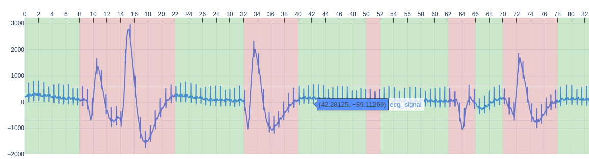

# ECG_QC (Quality Classification)


[](https://badge.fury.io/py/ecg-qc)
[](https://travis-ci.com/Aura-healthcare/ecg_qc)
[](https://codecov.io/gh/Aura-healthcare/ecg_qc)
[](https://www.codefactor.io/repository/github/aura-healthcare/ecg_qc)
[](https://www.gnu.org/licenses/gpl-3.0)
[](https://pepy.tech/project/ecg-qc)

[](https://sonarcloud.io/dashboard?id=Aura-healthcare_ecg_qc)



**Full Documentation** : https://aura-healthcare.github.io/ecg_qc/

**Website** : https://www.aura.healthcare

**Github** : https://github.com/Aura-healthcare

**Version** : 1.0b6

ecg_qc is a python library that classifies ECG signal into good/bad quality thanks to Machine Learning.

There are currently 4 trained models:
| Name | Type of model | (training) ECG time window | (training) ECG segments individual standardization |
| ------ | ----------- | ----------- | ----------- | 
| dfc_2s.pkl | Decision Tree Classifier | 2 seconds | No |
| rfc_2s.pkl | Random Forest Classifier | 2 seconds | No |
| rfc_2s_norm.pkl | Random Forest Classifier | 2 seconds | Yes |
| xgb_9s.joblib | XGboost Classifier | 9 seconds | No |


## Installation / Prerequisites

#### Dependencies

ecg_qc requires:

- Python (>= 3.6)
- biosppy>=0.6.1
- dill>=0.3.4
- pathtools>=0.1.2
- py-ecg-detectors>=1.0.2
- scikit-learn>=0.23.2
- wfdb>=3.1.1
- xgboost>=1.3.1

#### User installation

The easiest way to install hrv-analysis is using ``pip`` :

    $ pip install ecg-qc

you can also clone the repository:

    $ git clone https://github.com/Aura-healthcare/ecg_qc.git
    $ python setup.py install


## Getting started

### Usage

Import:

```python
from ecg_qc import EcgQc
```

Class initialization:

```python
ecg_qc = EcgQc()
```

Default parameters:

```python
ecg_qc = EcgQc(model='rfc_norm_2s.pkl',
               sampling_frequency=256,
               normalized=True)
```

Predicting the quality of the signal:

```python
ecg_data = [1905.72, ... -150.75995323, -134.14559104] # ECG values with same sampling frequency as class declaration

signal_quality = ecg_qc.get_signal_quality(ecg_data)
```

Computing SQIs before making prediction:

```python
ecg_data = [1905.72, ... -150.75995323, -134.14559104] # ECG values with same sampling frequency as class declaration

sqi_scores = ecg_qc.compute_sqi_score(ecg_data)
signal_quality = ecg_qc.predict_quality(sqi_scores)
```


## Authors

**Alexandre CHIROUZE** - (https://github.com/achirouze)

**Alexis COMTE** - (https://github.com/alexisgcomte)

**Laura DUMONT** - (https://github.com/laudmt)

## License

This project is licensed under the *GNU GENERAL PUBLIC License* - see the [LICENSE.md](https://github.com/Aura-healthcare/ecg_qc/blob/main/LICENSE) file for details


References
==========
Nemcova, A., Smisek, R., Opravilová, K., Vitek, M., Smital, L., & Maršánová, L. (2020). Brno University of Technology ECG Quality Database (BUT QDB) (version 1.0.0). PhysioNet. https://doi.org/10.13026/kah4-0w24.