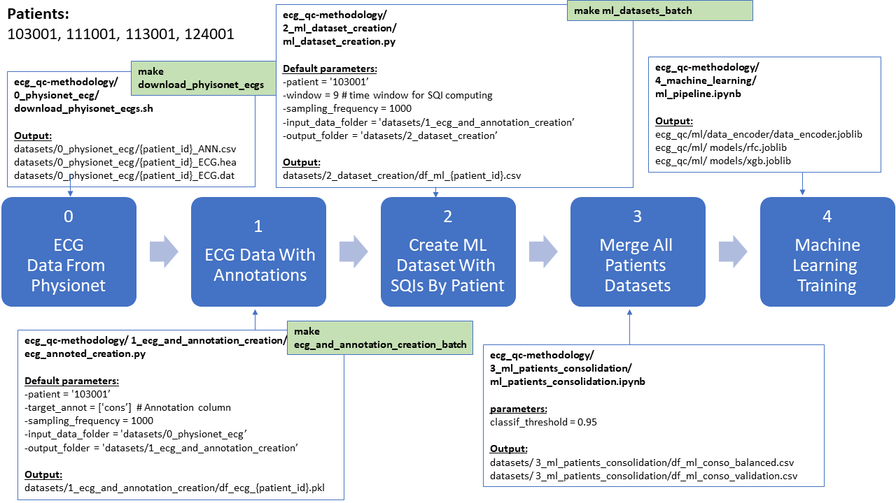
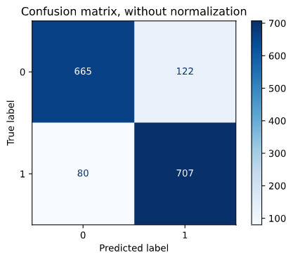
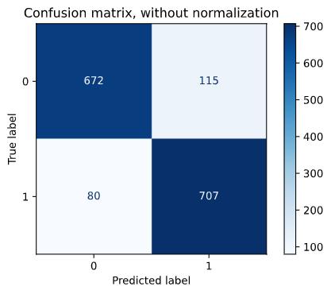
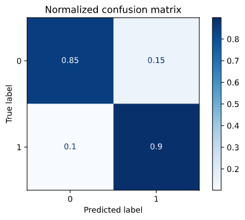

# ECG_QC METHODOLOGY


ECG_QC (ECG Quality Classifier) Methodology aims at creating a library to detect ECG quality through the computation of SQIs (Signal Quality Indexes). To do so, we used physionet library (acknowledgments at the end) to create a dataset to train a machine learning model. This model will be used to predict quality for new data.


## I - Process From Physionet To Machine Learning Model

### Global View Of The Process

We have selected patients 103001, 111001, 113001 and 124001 to make a machine learning dataset. SQIs are computed on a time_window of 9 seconds as some SQIs are sensible to short periods of time.



### Creating Proper Folders

In ecq_qc (root folder):

```
make generate_datasets_folder
```

This scripts creates the proper folder structure.


### 0 - Download Raw Patient Data From Physionet


In ecg_qc-methodology/0_physionet_ecg/download_phyisonet_ecgs.sh, add up the target patients line 1. 

Then, in ecq_qc (root folder), use bash command:

```
make download_phyisonet_ecgs
```

This script downloads 3 files by patients: 
- id_ECG.dat and id_ECG.head : the ECG data, with 1000 Hz frequency
- id_ANN.csv: annotations with timestamps of ECG quality change:
    - 1: optimal
    - 2: suspicious
    - 3: unqualified


### 1 - Merge ECG Data With Annotations


In ecg_qc-methodology/2_ml_dataset_creation/ml_dataset_creation_batch.sh, add up the target patients line 1.

Then, in ecq_qc (root folder), after you create "env" python environnement, use bash command:

```
make ecg_and_annotation_creation_batch
```

If you lack the permission, you can add it with:
```
chmod +x  ./ecg_qc-methodology/1_ecg_and_annotation_creation/ecg_and_annotation_creation_batch.sh
```

This script merges the ECG signal data with annotations and output a pickle file.


### 2 - Create ML dataset with SQIs by patient


In ecg_qc-methodology/2_ml_dataset_creation/ml_dataset_creation_batch.sh, add up the target patients line 1.

Then, in ecq_qc (root folder), after you create "env" python environnement, use bash command:

```
make ml_datasets_batch
```

If you lack the permission, add it with:
```
chmod +x  ./ecg_qc-methodology/2_ml_dataset_creation/ml_dataset_creation_batch.sh
```

From the ECG signal and annotation file, the script computes SQIs over a time window (9 seconds by default) and an ECG frequency (1000 hz by default) and output a ML dataset by patient.

For machine learning purpose, the 3 orignal labels are transposed in two:
- 1: optimal (nothing changes)
- 0: suspicious or unqualified, former 2 and 3
All data without annotation is removed.

Then, we generate two metrics:
- classif: value at 1 if all  the values over the time windows are 1, else 0
- classif_avg : the average of the classifications over a time window, ie the percentage of optimal


### 3 - Merge All Patients Datasets

First, all patients are merged in a same dataset and a threshold of quality is applied: if classif_avg >= 95%, classif_threshold = 1, else 0

Then, the notebook creates the two datasets machine learning dataset:
- The validation dataset takes a subset of consolidated dataset. No balancing is done.
- The machine learning dataset, used to train future model. The class by patient is equalized to have balanced classes


### 4 - Machine Learning Training


From the dataset, we make a pipeline of machine learning with machine learning dataset. The highlights of the notebook:
- Preprocessing: a train/test split of 80% is selected
- 3 algoriths are tested with Grid Search and Cross Validation = 5:
    - Logistic Regression
    - Random Forest Classifier
    - XGBoost
- For Grid Search, target metrics is ROC_AUC.

The models can be exported to:
- feature encoder : data/data_encoder/data_encoder.joblib
- rfc : data/models/rfc.joblib
- xgb : data/models/xgb.joblib

The validation dataset allow use to have feedback on "real data".


## II - Machine Learning Results (to be updated)


### A - Random Forest Classifier Performance


| Metrics | Train | Test |
| ------:| ----:| ----:|
| Accuracy   | 0.920 | 0.871 |
| f1-score   | 0.922 | 0.875 |
| Precision   | 0.905 | 0.852 |
| Recall   | 0.940 | 0.898 |
| **ROC_AUC_score** |  0.920 | **0.871** |





### B - XGBoost Performance


| Metrics | Train | Test |
| ------:| ----:| ----:|
| Accuracy   | 0.971 | 0.876 |
| f1-score   | 0.972 | 0.879 |
| Precision   | 0.963 | 0.860 |
| Recall   | 0.981 | 0.898 |
| **ROC_AUC_score** | 0.972 | **0.876** |






### C - Model Comparison


Best performance is achieved with XGboost, but with some large overfitting. On train set over ROC_AUC_score, the performance gain of XGBoost of RFC is impressive (from 92.0% to 97.2%). However, on test set, XGboost does not really improve performance (from 87.1% to 87.6%), despite cross-validation with 5-fold to limit overfitting. 


## Conclusion, Limits And  Possible Improvements


We have create an efficient model to discriminate optimal from suspicious/unqualified signal. XGboost allows the best performance, but Random Forest Classifier is pretty close on validation dataset. 

Even if the Machine Learning in addition to SQI allows does not offer best performance, especiallycompared to a more complexe and precise approach such as Deep Learning. However, fast computation and explainability make it interesting in several situations. 

A more efficient and robust model might be possible for future research over several leads, among them:
- Adding additional patients to improve ECG signature diversity
- Making ECG sample by patients equal
- Shifting time window (9 seconds in our methodology)
- Make feature engineering over SQIs
- Better fine tuning of ML hyperparameters


# Acknowledgments

Nemcova, A., Smisek, R., Opravilová, K., Vitek, M., Smital, L., & Maršánová, L. (2020). Brno University of Technology ECG Quality Database (BUT QDB) (version 1.0.0). PhysioNet. https://doi.org/10.13026/kah4-0w24.