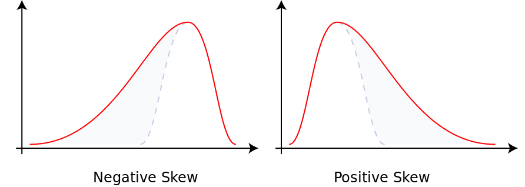

API documentation
==================

ecg_qc is a pyton library that classifies ECG signal to 0 = bad quality and 1 = good quality.

0 = bad quality corresponds to an ECG signal containing baseline shift, hight frequency noise which disturbs the QRS analysis.

1 = good quality corresponds to a clean ECG signal where the QRS can be perfectly detected.

ecg_qc main class
-----------------

.. automodule:: ecg_qc.ecg_qc
    :members:
    :show-inheritance:
    
    
    
Frequency distribution sqi
--------------------------

**Skewness**

Skewness is a measure of the asymmetry of a distribution around its mean. It can be negative, null or positive. To describe the skewness, we compute the Pearson's moment coefficient, corresponding to the third standardized moment.

    
`https://en.wikipedia.org/wiki/Skewness#Pearson's_moment_coefficient_of_skewness <https://en.wikipedia.org/wiki/Skewness#Pearson's_moment_coefficient_of_skewness>`_

    

When we have
    * Symetrical distribution, the skewness coef = 0
    * Asymetrical distribution skewed on the left, the skewness coef is > 0
    * Asymetrical distribution skewed on the right, the skewness coef is > 0

**Kurtosis**

Kurtosis is a measure tailedness of the distribution around its mean. To describe the kurtosis, we compute the Pearson's moment coefficient, corresponding to the fourth scaled moment.
The excess kurtosis is defined as the kurtosis minus 3 (3 being the kurtosis coef of a normal distribution). The kurtosis can be positive or negative.

High excess kurtosis means that there are outliers far away from the distribution's mean.

 .. image:: images/kurtosis.png
    :width: 500
    
`https://www.statext.com/android/kurtosis.html <https://www.statext.com/android/kurtosis.html>`_

When we have
    * Mesokurtic distribution (black) : excess kurtosis = 0
    * Leptokurtic distribution (green) : excess kurtosis > 0
    * Platykurtic distribution (blue) : excess kurtosis < 0

.. automodule:: ecg_qc.sqi_computing.sqi_frequency_distribution
    :members:
    :undoc-members:
    :show-inheritance:

Power spectrum sqi
------------------

**Power spectrum distribution of QRS Wave**

The energy of the QRS wave is computed on frequencies ranging from 5Hz to 15Hz (the energy of the QRS wave is concentrated in a frequency band centered at 10 Hz and is 10 Hz in width), 
the energy of the ECG signal is computed on frequencies ranging from 5Hz to 40Hz.
. 

If interference exists, the high-frequency component increases, and pSQI decreases.

Let's take the following clean ECG signal. The computed psqi = 0.07.

Let's now take an ECG with high frequencies noise. The computed psqi = 0.3.

.. image:: images/noise_ecg_signal.png
    :width: 500

**Relative power in the Baseline**

It corresponds to the ratio of the energy of the QRS wave and the energy of the ECG signal.
The energy of the baseline is computed on frequencies ranging from 0Hz to 1Hz, the energy of the ECG signal is computed on 
frequencies ranging from 0Hz to 40Hz.

If there is no baseline drift interference, the basSQI value is close to 1. An abnormal shift in the baseline causes the bassqi to decrease.

Let's take the following clean ECG signal. The computed bassqi = 0.99.

Let's now take an ECG with important baseline shift. The computed bassqi = 0.97.

.. image:: images/baseline_shift_ecg_signal.png
    :width: 500

.. automodule:: ecg_qc.sqi_computing.sqi_power_spectrum
    :members:
    :undoc-members:
    :show-inheritance:

R-R interval sqi
------------------

An ECG signal is a periodic signal composed of P, Q, R and T wave.

.. image:: images/pqrst_wave.jpg
    :width: 500

`https://www.aclsmedicaltraining.com/basics-of-ecg/ <https://www.aclsmedicaltraining.com/basics-of-ecg/>`_

R wave has the maximum amplitude and most obvious characteristic so we often characterize the ECG signal by R wave detection. 

.. automodule:: ecg_qc.sqi_computing.sqi_rr_intervals
    :members:
    :undoc-members:
    :show-inheritance:
    